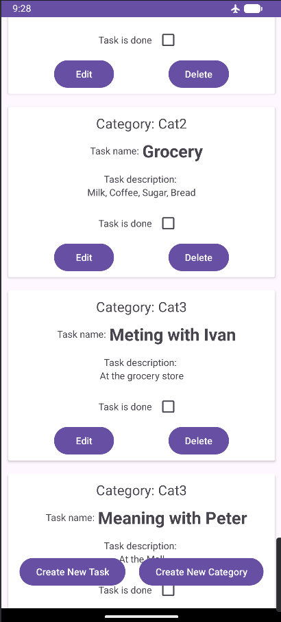
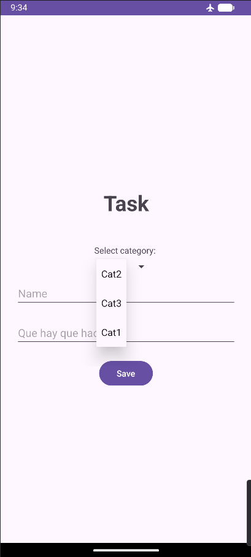
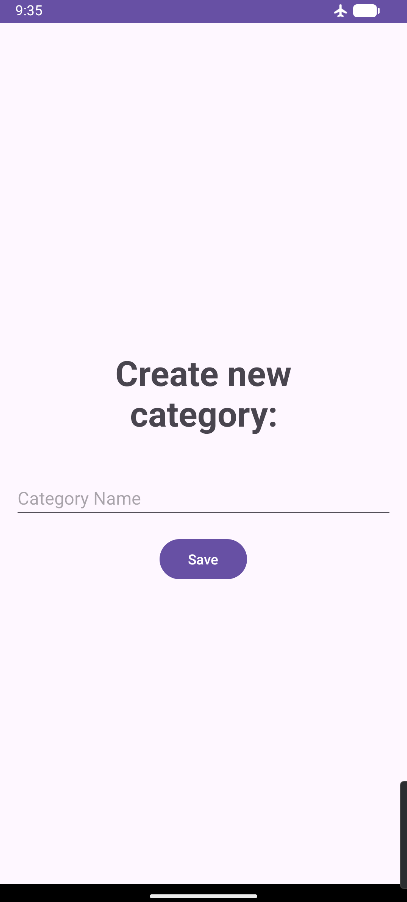
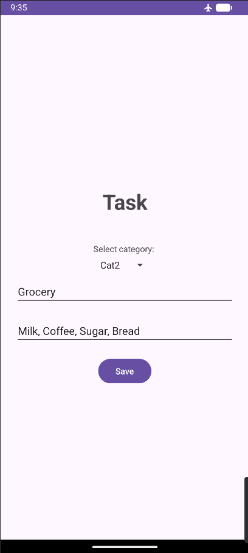

# TaskList Simple Task Management Android App

Kotlin app for creating and managing daily tasks. Clean list based interface focused on core productivity functionality.

## Features
- Add new task
- Edit task
- Delete task
- Add new category
- View and manage task list
- Basic CRUD operations

## Tech Stack
- **Language**: Kotlin
- **UI**: XML layouts + RecycleView
- **Persistence**: Local storage (SQLite database with SQLiteOpenHelper API)

This app is great example of SQLite data base.

## Screenshots

    
    
    
    

## Setup
1. Clone repo
2. Open in Android Studio
3. Sync Gradle -> Run on emulator/device (min SDK 21)
